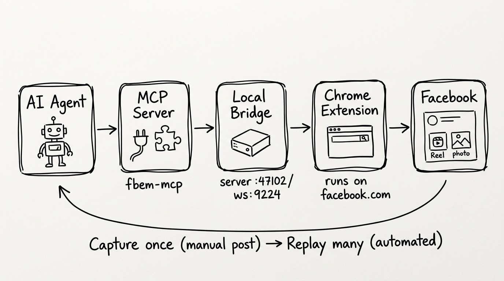

# FBEM — Facebook Extension Crawler + MCP

**Crawl/snapshot Facebook's native composer web API and publish Reels / Photos
through a Chrome extension — exposed to any agent as an MCP server.**

FBEM drives the *same internal web API a logged-in human uses on facebook.com*
(NOT the Graph API, which suppresses reach on API-published posts). It learns the
exact upload shape by **passively snapshotting** the requests you make by hand,
then **replays** that template with fresh media + fresh volatile tokens — so it is
self-healing and needs no reverse-engineering when Facebook rotates its payload.

Any MCP-capable agent (Claude Code / Claude Desktop / Cursor / …) can plug in and
call `post_reel`, `post_photos`, `switch_profile`, `get_identity`, `health`, and
`capture_status`. Adding a new tool is one file — see [CONTRIBUTING.md](CONTRIBUTING.md).

> ⚠️ **Local tool, loopback-only.** The bridge binds `127.0.0.1` and is
> unauthenticated by design. It runs on *your* machine against *your* logged-in
> browser session. Never expose it to a network. Use it only on accounts you own
> and in line with Facebook's terms.

---

## Architecture



```
  any MCP agent  (Claude Code / Desktop / Cursor / …)
       │  stdio  (MCP protocol)
       ▼
  fbem-mcp ──HTTP(loopback :47102)──► fbem-bridge ──WS(:9224)──► Chrome extension
  (FastMCP;                           (FastAPI +                  (crawler + replay,
   tools/ = one file per tool)         WS server)                  injected in-page)
                                                                       │ runs inside
                                                                       ▼
                                                                 facebook.com tab
                                                                 (your live session)
```

- **`fbem-bridge`** (persistent) holds the WebSocket to the extension, serves
  media over loopback, and stores captured templates. Run it once; leave it up.
- **`fbem-mcp`** (spawned by the agent) is a thin stdio layer that calls the
  bridge over HTTP. Because it's separate, every agent can spawn its own MCP
  process without fighting over the extension's WebSocket port.
- **Chrome extension** has three jobs, all inside the page's own context:
  1. **Crawler** — monkeypatches `fetch`/`XHR` to *passively* snapshot the genuine
     native upload requests when you post by hand. Never blocks or mutates them.
  2. **Tokens** — scrapes fresh volatile tokens (`fb_dtsg`, `lsd`, `jazoest`, …).
  3. **Replay** — reproduces a captured template with new media + fresh tokens.

## How it works: capture-then-replay

Replay is **template-driven** and only activates after one real capture per kind.

1. Start the bridge and load the extension; open a **logged-in** facebook.com tab.
2. **Post one item by hand** (a Reel, a photo/album, a page switch).
3. The crawler snapshots the real requests (the `rupload`/photo upload + the
   `ComposerStoryCreateMutation` publish) and POSTs them to the bridge, which
   folds them into `template.json`.
4. From then on, the matching MCP tool replays automatically — fresh video/photo,
   fresh tokens, same proven shape.

When Facebook rotates its payload and replay starts failing, just **re-capture**
(repeat steps 2–3). No code change is ever required.

## Quickstart

### 1. Install

```sh
git clone https://github.com/crisng95/fbem.git FBEM && cd FBEM
python3.11 -m venv .venv
.venv/bin/pip install -e .
```

### 2. Run the bridge (leave it running)

```sh
.venv/bin/fbem-bridge          # HTTP :47102 + WS :9224, loopback only
```

### 3. Load the Chrome extension

`chrome://extensions` → enable **Developer mode** → **Load unpacked** → select the
`extension/` directory. See [extension/README.md](extension/README.md). Keep a
logged-in `www.facebook.com` tab open — replay runs inside it.

### 4. Seed a template (one manual post)

With everything running, post **one** Reel (and one photo/album) by hand. Confirm:

```sh
curl -s http://127.0.0.1:47102/api/health | python3 -m json.tool
# look for: extension_connected: true, has_template: true, has_photo_template: true
```

> **Reusing an existing fb-studio template?** Point the bridge at its captures and
> skip re-snapshotting entirely:
> ```sh
> FBEM_CAPTURES_DIR=/path/to/fb-studio/bridges/fb-bridge/captures fbem-bridge
> ```

### 5. Plug the MCP into your agent

**Claude Code:**
```sh
claude mcp add fbem -- /abs/path/to/FBEM/.venv/bin/fbem-mcp
```

**Claude Desktop** (`claude_desktop_config.json`):
```json
{
  "mcpServers": {
    "fbem": { "command": "/abs/path/to/FBEM/.venv/bin/fbem-mcp" }
  }
}
```

**Any MCP client:** run the command `fbem-mcp`, transport **stdio**.

The agent can now call the tools below. (The bridge from step 2 must stay running.)

## MCP tools

| Tool | What it does |
|------|--------------|
| `post_reel` | Publish a Reel from a local `.mp4`. Args: `video_path`, `caption`, `page_id?`, `scheduled_publish_time?`. |
| `post_photos` | Publish a photo (1 file) or album (N files) from local `.jpg/.png`. Args: `image_paths[]`, `caption`, `page_id?`, `scheduled_publish_time?`. |
| `switch_profile` | Switch the acting page/profile so later posts go out AS that page. Args: `target_id`. |
| `get_identity` | Read which page/profile the tab currently posts AS (read-only). |
| `health` | Bridge + extension health (connection, templates, tab TTL). |
| `capture_status` | Crawler/snapshot status: what's captured, what's ready to post, and exactly what to (re)snapshot if not. |

## When do I need to (re)snapshot?

- **First run / a kind never captured** → yes: post that kind once by hand.
- **Reel vs Photo vs Switch are separate templates** → capturing a Reel does not
  enable photo posting; capture each kind once.
- **Already captured and working** → no. Templates persist in `FBEM_CAPTURES_DIR`.
- **Facebook rotated its payload (replay errors like `story_create=null`,
  `no_template_captured`, repeated 502s)** → re-capture that one kind by hand.

Ask the agent to call `capture_status` any time — it reports exactly what's ready
and what to do.

## Configuration

All optional; sensible loopback defaults. See [.env.example](.env.example).

| Env | Default | Purpose |
|-----|---------|---------|
| `FBEM_HTTP_PORT` | `47102` | Bridge HTTP API port |
| `FBEM_WS_PORT` | `9224` | Extension WebSocket port |
| `FBEM_WS_HOST` | `127.0.0.1` | WS bind host (must be loopback) |
| `FBEM_HOME` | `~/.fbem` | Base dir for state |
| `FBEM_CAPTURES_DIR` | `$FBEM_HOME/captures` | Captured templates (contain live tokens) |
| `FBEM_MEDIA_DIR` | `$FBEM_HOME/media` | Media served to the extension |
| `FBEM_BRIDGE_URL` | `http://127.0.0.1:47102` | Where the MCP reaches the bridge |

## Security

- **Loopback-only & unauthenticated by design.** Startup refuses a non-loopback
  `FBEM_WS_HOST`. Never port-forward or proxy it.
- **Captures contain live FB tokens** (`fb_dtsg`, `lsd`, cookies). `captures/` is
  git-ignored — never commit it. Treat `FBEM_CAPTURES_DIR` as a secret.
- **No tokens in code.** The callback secret is random per process; volatile FB
  tokens are scraped live from the page at replay time.

## Project layout

```
fbem/
  bridge/        persistent backend (FastAPI :47102 + extension WS :9224)
    server.py · ws_server.py · bridge_client.py · capture_store.py · config.py · run.py
  mcp/           the MCP server (any-agent pluggable)
    server.py · registry.py · bridge_api.py
    tools/       ONE FILE PER TOOL  ← the contribution surface
      _template.py · post_reel.py · post_photos.py · switch_profile.py
      get_identity.py · health.py · capture_status.py
extension/       Chrome MV3 (crawler snapshot + replay)
docs/PROTOCOL.md the decoded native upload protocol
```

## Contributing

Adding a tool is one file. Copy `fbem/mcp/tools/_template.py`, write a typed async
function, done — it's auto-discovered. See **[CONTRIBUTING.md](CONTRIBUTING.md)**.

## License

[MIT](LICENSE).
